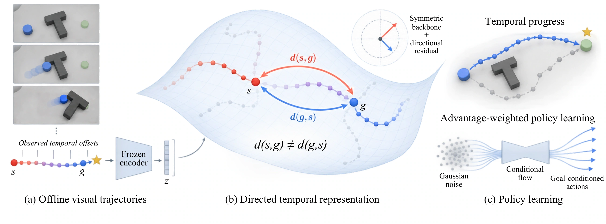

# Directed Temporal Representations for Control

**DTRC** learns a directed temporal distance on frozen LeWorldModel (LeWM)
features. Offline trajectories organize the representation by goal-reaching
cost in environment steps. The temporal critic guides policy learning through
recorded actions and supported model-predicted improvements.

[Installation](#1-install) · [Models](#2-download-models) ·
[Datasets](#3-download-data) · [Evaluation](#4-evaluate-a-pretrained-model) ·
[Training](#5-train-dtrc)



## 1. Install

Use Linux with an NVIDIA GPU and a driver compatible with CUDA 12.4.
Download this repository with **Code → Download ZIP** or `git clone`, enter
the repository directory, and run:

```sh
conda env create -f environment.yml
conda activate dtrc
export MUJOCO_GL=egl
export STABLEWM_HOME="$PWD/data"
```

The environment includes PyTorch 2.6.0, Stable-WorldModel 0.1.1, OGBench
1.2.1, and the dependencies needed by these ten tasks. A system EGL library
is required for headless MuJoCo rendering. Run all commands below from the
repository root with this environment active.

## 2. Download models

Download the following archives from [GitHub Releases](../../releases):

| File | Contents |
|---|---|
| **DTRC-checkpoints.zip** | Final trained DTRC checkpoints for all ten tasks |
| **DTRC-encoders.zip** | The ten matching frozen LeWM encoders and their configurations |

| Task group | Included tasks |
|---|---|
| LeWM | PushT, TwoRoom, Reacher, Cube |
| Visual OGBench | PointMaze, Cube-Double, Scene, AntMaze-Medium, HumanoidMaze-Medium, Puzzle-3x3 |

For the four LeWM tasks, we use the official pretrained LeWM encoders.
For the six OGBench tasks, we include the visual encoders used in our runs.
**All encoders stay frozen during DTRC training.** Each DTRC checkpoint was
trained for 200,000 updates with seed 42 and contains the control representation,
temporal critic, policy, auxiliary models, and normalization statistics.
These are the final trained models, not encoder-only checkpoints.

For evaluation, extract both archives in the repository root. To train a
new DTRC model, only **DTRC-encoders.zip** is required:

```sh
unzip DTRC-checkpoints.zip
unzip DTRC-encoders.zip
```

```text
models/
├── model_index.json
├── dtrc/<task>/final.pt
└── encoders/<task>/
    ├── config.json
    └── weights.pt
```

Task identifiers use lowercase names, such as `pusht`, `cube-double`, and
`antmaze-medium`. Use each checkpoint with its matching encoder. If you
downloaded both archives, check the model files and loading interfaces with:

```sh
python scripts/verify_models.py --root . --device cuda
```

## 3. Download data

Choose a task. The download script fetches its files from the official
[LeWM collection](https://huggingface.co/collections/quentinll/lewm) or
[OGBench datasets](https://github.com/seohongpark/ogbench).

```sh
# LeWM data, used for both training and evaluation.
python scripts/download_data.py --task pusht

# OGBench evaluation data only.
python scripts/download_data.py --task pointmaze --purpose eval
```

For OGBench training, use `--purpose train`; use `--purpose both` to fetch
both sets. The official OGBench downloader also fetches validation files.
`--list-only` displays the exact URLs without downloading.

[Data preparation](docs/data.md) lists all ten tasks, official file links,
disk requirements, and the image-conversion commands for OGBench.
LeWM HDF5 files go under **`data/datasets/`**, and OGBench NPZ files under
**`data/ogbench/`**. Download only the tasks you need.

## 4. Evaluate a pretrained model

Both task groups use RGB current and goal observations. Evaluation samples
start–goal pairs from recorded trajectories; `--goal-offset` counts recorded
transitions and `--budget` sets the interaction limit. Save and reuse the
same manifest to compare methods on identical pairs.

### LeWM tasks

After downloading PushT data and the model archives:

```sh
export STABLEWM_HOME="$PWD/data"
export MUJOCO_GL=egl

dtrc-manifest-lewm --task pusht --dataset pusht_expert_train.h5 --num-eval 50 \
  --goal-offset 25 --seed 42 --output manifests/pusht.json

dtrc-evaluate-lewm --task pusht \
  --dataset pusht_expert_train.h5 \
  --checkpoint models/dtrc/pusht/final.pt \
  --lewm-checkpoint models/encoders/pusht \
  --manifest manifests/pusht.json \
  --budget 50 --seed 42 --output results/pusht.json
```

### Visual OGBench tasks

After downloading PointMaze evaluation data and the model archives:

```sh
export MUJOCO_GL=egl

dtrc-manifest-ogbench --task pointmaze \
  --state-npz data/ogbench/pointmaze-large-navigate-v0.npz \
  --goal-offset 25 --num-eval 50 --seed 42 \
  --output manifests/pointmaze.json

dtrc-evaluate-ogbench --task pointmaze \
  --checkpoint models/dtrc/pointmaze/final.pt \
  --lewm-checkpoint models/encoders/pointmaze \
  --state-npz data/ogbench/pointmaze-large-navigate-v0.npz \
  --manifest manifests/pointmaze.json \
  --goal-offset 25 --num-eval 50 --budget 50 --seed 42 \
  --output results/pointmaze.json
```

Evaluation restores simulator states and renders current and goal images.
The policy receives only RGB images. Evaluation does **not** require a
Lance conversion or a latent cache.

For a short execution check, set `--num-eval 2` in both OGBench commands
(in the manifest command for LeWM) and `--budget 3` in the evaluator.
This checks loading and execution, not model performance.

Our recorded future-goal evaluation differs from the official OGBench
fixed-goal protocol. Datasets and the paper's evaluation manifests are not
included. Exact table reproduction requires the matching manifests and
simulator versions. See [evaluation details](docs/evaluation.md) for metrics.

## 5. Train DTRC

Training learns a new representation, critic, and policy while keeping the
downloaded encoder frozen. It does not load a final DTRC checkpoint.

### LeWM tasks

Download the data and encoder, cache the image features, then train:

```sh
dtrc-cache-hdf5 --task pusht \
  --h5 data/datasets/pusht_expert_train.h5 \
  --lewm-checkpoint models/encoders/pusht \
  --output-dir data/pusht_latents --device cuda

dtrc-train --config configs/dtrc.json \
  --latent-cache data/pusht_latents \
  --out runs/pusht --seed 42 --device cuda
```

### OGBench tasks

Convert the official NPZ to image trajectories, then cache and train.
PointMaze conversion renders images from recorded simulator states;
the other five tasks provide images in their official visual datasets.

```sh
python scripts/download_data.py --task pointmaze --purpose train

dtrc-prepare-ogbench --task pointmaze \
  --source data/ogbench/pointmaze-large-navigate-v0.npz \
  --output data/ogbench/visual-pointmaze-large-navigate-v0.lance \
  --work-dir data/preparation

dtrc-cache-lance --task pointmaze \
  --lance data/ogbench/visual-pointmaze-large-navigate-v0.lance \
  --lewm-checkpoint models/encoders/pointmaze \
  --output-dir data/pointmaze_latents --device cuda

dtrc-train --config configs/dtrc.json \
  --latent-cache data/pointmaze_latents \
  --out runs/pointmaze --seed 42 --device cuda
```

Use the [task-specific filenames](docs/data.md#ogbench-tasks) for the other
five tasks. Their **visual training NPZ and state-based evaluation NPZ are
different files**; do not pair their rows.

Training writes logs, the resolved configuration, and
`checkpoints/latest.pt` and `checkpoints/final.pt` under the run directory.
To evaluate your newly trained model, replace the evaluator's `--checkpoint`
with `runs/<task>/checkpoints/final.pt` and keep the same encoder.

### Check the pipeline before a full run

Add `--max-episodes 2` to `dtrc-cache-hdf5` (LeWM) or
`dtrc-prepare-ogbench` (OGBench), and use separate output paths such as
`data/smoke/pusht_latents`. Then run:

```sh
dtrc-train --config configs/dtrc.json \
  --latent-cache data/smoke/pusht_latents --out runs/smoke/pusht \
  --train-steps 20 --batch-size 32 --log-every 10 \
  --save-every 20 --holdout-every 0 --seed 42 --device cuda
```

This verifies data loading, optimization, and checkpoint writing. For full
training, remove the episode limit, build a new full cache, and use the
200,000-update configuration above. Do not reuse the small smoke-test cache.

[Configuration details](docs/configuration.md) list the hyperparameters and
component comparisons. The main implementation is in
[`models.py`](src/dtrc/models.py) (representation and networks),
[`agent.py`](src/dtrc/agent.py) (training), and
[`policy.py`](src/dtrc/policy.py) (image-conditioned execution).
See [implementation details](docs/method.md) for the training objectives.

Run the numerical and interface tests with:

```sh
python -m unittest discover -s tests -v
```

## Acknowledgements

DTRC builds on [LeWorldModel](https://github.com/lucas-maes/le-wm),
[Stable-WorldModel](https://github.com/galilai-group/stable-worldmodel), and
[OGBench](https://github.com/seohongpark/ogbench), and draws on
[Hilbert representations](https://github.com/seohongpark/HILP) and
metric–residual directed distances. This repository includes DTRC and its
component variants, not the comparison baselines.
See [third-party notices](licenses/README.md) for attribution and licensing.
